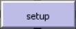

# Agent-Based Modeling for Ecology in NetLogo

## 0. Preparation <br>

1. Install the latest version of NetLogo from the dedicated [website](https://ccl.northwestern.edu/netlogo/6.2.1/).
2. Make sure the installation is successful and open NetLogo.
3. Grab the presentation [here](https://github.com/Stef-Boogers/NetLogo-for-ecology-tutorial/blob/7ecc3bbc0941d7db4e13f4862a671f0e17ab5287/assets/Agent-Based%20Modelling%20for%20Ecologists.pptx), if needed. There's a **Download** button on the right.
4. Open the well-documented [NetLogo dictionary](https://ccl.northwestern.edu/netlogo/docs/dictionary.html), which will answer most questions you have about specific algorithms.
5. Also open the [Interactive Dictionary](https://ccl.northwestern.edu/netlogo/bind/primitive/patches.html), which will answer all remaining questions with great examples.
6. Follow the presentation at 12.30, either in room 01.252 or through Teams. After the presentation, you're ready to get started on the next section! <br>
--- <br>

## 1. Fireflies: playing with your first model <br>

In NetLogo, go to *File > Models Library* or type `Ctrl+M`. There, use the search bar at the bottom of the screen and type "Fireflies". The folder tree structure will show one option, under the folder "Biology". Doubleclick "Fireflies" and the model will load. If this fails, you can run the model online [here](http://www.netlogoweb.org/launch#http://ccl.northwestern.edu/netlogo/models/models/Sample%20Models/Biology/Fireflies.nlogo).
<br><br>
- Click the "Info" tab up top to get your bearings. What is being modelled? What are the different options? What do the authors recommend that you try?
- Get back to the "Interface" tab. On the left, you will find some typical input boxes (green). You can fidget around with them if you like. Nothing will happen yet. I advise you to set  to "On".
- When you have found some settings that suit you, press . Afterwards, press . The "go" button has a roundabout sign, which means that this procedure keeps repeating until you press the button again or until a predetermined number of 'ticks' or timesteps has passed.
- Does the output of the model match your expectations? Play around with settings. You can often do this while the model is running and see an immediate response. Some inputs are however only passed into the model during the "setup" procedure, meaning that changing them during the "go" procedure won't have an influence.

**To remember:**

> NetLogo is fun. Especially if someone else built the model. <br>
> Procedures, euhm, exist. So do ticks.<br>
> Please tell me more. Especially code, I love code.

---

## 2. Typical NetLogo code structure <br>

Onwards to coding! All NetLogo models follow the same general structure. Within that framework however, the user has a lot of freedom. <br>
NetLogo follows a class-based object-oriented paradigm, in which the user has to define classes (the types of turtles and patches), the attributes of these classes and the methods that can be applied to them. A fake example using pseudocode for a basic grass-sheep-wolves predation model should make the rudimentaries clear. NOTE: not real code! <br><br>

### A. Globals

At the top of our code, we name the global parameters. These are parameters that have the same value for all agents, across all procedures.
All values set through the user inputs on the interface page are considered globals. You only name the parameter here and will set its value later.

```
; Semicolons comment out lines. 

; Imagine that you want the model to stop when the screen becomes crowded with sheep. 

globals [
  max-sheep
]

; NetLogo code is mostly written using "-" (hyphen) instead of the more traditional "_" (underscore).
```
<br>

### B. Turtle-own

After the globals, we name our classes of (non-patch) agents: the turtles. In our case, there are two separate classes: wolves and sheep. In our model, they both only have one 
attribute: their energy level. We use the **breed** primitive to show NetLogo what an instantiation of both classes will be called and then define the attributes.

```
breed [ wolves wolf ] 
; This creates the turtleset "wolves". 
; Its members are each called "wolf" and receive a sequantial number when they are created (wolf 1, wolf 2, ...).

breed [ sheep a-sheep ]
; Same for sheep.

wolf-own [ energy-level ]
sheep-own [ energy-level ]
; Faster way to do the same thing: turtles-own [ energy-level ]

```
Turtles come with several built-in attributes that don't need to be named here: their color, their pictogram size etc. <br>
### C. Patch-own

Just like turtles, the patches in the simulation also have attributes. These can be coded using "patch-own". We won't name anything at this stage. On to the next section!

### D. Procedures

We have now described the playing field and the characters, but how do we get them to do things? Move? Change color? Kill each other without regard? For this, you need **procedures**. Their general syntax is as follows: <br>
```
to procedure
  do something
end
```
Simple enough! Now, remember the  and  buttons? These actually start the two most important procedures:
```
to setup
  clear the playing field from last time
  reset the tick counter
  generate wolves
  generate sheep
  set the state of patches (grass/bare)
end

to go 
  if tick-counter < max-ticks [
    sheep-movement
    sheep-feed
    sheep-reproduction
    wolf-movement
    wolf-feed
    wolf-reproduction
    grass-regeneration
    add one tick to counter
  ]
end

to sheep-movement
...
```
As previously mentioned, the "go" procedure keeps repeating indefinitely. The above code still lacks some finesses, such as a death procedure. Anyway, now that you understand the basic programming flow, it's time to jump in head-first with coding. <br>
**To remember:**

> NetLogo is still fun. <br>
> Classes, attributes, breeds, globals... I eat that stuff for breakfast. <br>
> Now where's the code you promised?

---
## 3. Building a program
Don't worry if the NetLogo syntax feels a little uneasy at first. Engineers are used to harsher environments, which in this case can actually be a disadvantage. When in doubt, just type your command in as if you knew nothing of coding. That actually works quite often. <br>
During coding, you will often switch between the "Code" and "Interface" tabs to add or adapt user inputs and to see the functioning of your model. 

### A. Interface
1. Start a new, blank model in NetLogo (*File > New* or `Ctrl+N`). 
2. On the Interface tab, add a button to call the setup procedure To do this, set the drop down menu in the banner to "Button" (default option)  <br>
and click the plus sign to its left. Now click anywhere in the white space.
 - Next to "Agent(s)", select "observer". 
 - Under "Commands" and next to "Display name", type "setup".
 - Leave the "Forever" and "Disable until ticks start" tick boxes open, as well as the "Action key" field.
3. Redo step 2 for the "go" procedure. This procedure needs to repeat indefinitely, so tick the "Forever" box.
4. Now add three slider inputs in a similar way. Fill in the terms below as "Global variable", and use the minimum - increment - maximum values shown.
 - initial-number-sheep: 0 - 1 - 250
 - initial-number-wolves: 0 - 1 - 250
 - grass-regrowth-time: 0 - 1 - 100
5. Finally, right-click the output visualizer (the big black square), click "Edit" and match the settings to the screenshot below <br>

<p align="center">
  
</p>  

### B. Code
We already described what the code section should contain. Now it's time to actually code it. Go to the "Code" tab and type the following:
```
globals [
  max-sheep
]

breed [ wolves wolf ]
breed [ sheep a-sheep ]

turtles-own [ energy-level ]
```
You already know what this code does. Didn't think it would actually work, did you? Click "check" in the banner and NetLogo will quickly see if the code will at least compile. Unfortunately, that doesn't mean your model will run. So far, so good? If not, shout. <br>

We can now get started on the setup procedure. I wonder what the command to clear everything could be?
```
to setup
  clear-all             ; clears... everything.
  reset-ticks           ; resets the tick counter.
  set max-sheep 2000    ; limiting the amount of sheep by setting the max-sheep global (no effect yet)
  
  create-sheep initial-number-sheep [   ; create an amount, determined by input slider, of sheep and initialize their variables.
    set shape "sheep"
  ]
  
  create-wolves initial-number-wolves [ ; same for wolves. 
    set shape "wolf"
  ]

end
```
If you got that to work, it's time to get a little creative. Use the dictionary if needed.<br>
*Assignment:* <br>
> Set the `color` and `size` attributes of both sheep and wolves to something aesthetically pleasing.
> Set the starting x- and y-coordinates of sheep and wolves to random numbers (Hint: see "setxy").
>
>
> Possible solution [here](assets/Assignment1.txt).

Go back to the Interface tab and see what happens when you press the setup button. You should see your sheep and wolves appearing. <br> <br>
One thing is still missing from the setup procedure: the environment. Return to your code and add the following inside of the setup procedure: 
```
ask patches [                                       ; tell the patches to do something
      set pcolor one-of [ green brown ]             ; patch color is set randomly to either green (grass) or brown (bare)
      ifelse pcolor = green                         ; if the patch is green, 
      [ set countdown grass-regrowth-time ]         ; then set a regrowth clock to the maximum value
      [ set countdown random grass-regrowth-time ]  ; if the patch is brown, set the regrowth clock to a random value between zero and the maximum value
]
```
Oops, something went wrong there. It seems that there's nothing called "countdown"... Could you perhaps fix that?

*Assignment:* <br>
> Solve the issue of the missing attribute.
>
>
>
> Hint: you need an additional ...-own declaration at the start of your code.

Again, admire your progress in the Interface tab. The setup procedure is now complete. In order to build the go procedure, you need a few extra sliders. These will define the odds of reproduction and the amount of energy gained from food. Specifically:


## Fun other models to play with 
- [Camas-Douglas fir fire model](http://modelingcommons.org/browse/one_model/6020#model_tabs_browse_nlw): progression of a wildfire across a plairie filled with camas, becoming invaded with Douglas fir when a steady fire regime is abandoned. Similar to the burning of heath fields in our own region. 
- Autumn: you can find this one in NetLogo's modelling library (`Ctrl+M`). Model of a single tree losing its leaves due to the interactions of wind, rain, sun regime and branch architecture. A good example of how the modeling output window doesn't have to be a bird's eye view.
- Pac-Man: again from the modelling library. Yes, you can build simple games in NetLogo. But it's a little underwhelming.
- [Game of Thrones](https://www.comses.net/codebases/08e45650-f6a9-4c26-a99f-2938e7d8cbdc/releases/1.7.0/): a didactic exercise in Logo, NetLogo's spiritual predecessor. Layer by layer, the island of Westeros and its warring Houses are built from the ground up, only to let the White Walkers and the occasional dragon burn everything to the ground. Great timewaster and actually pretty informative, too.<br>


